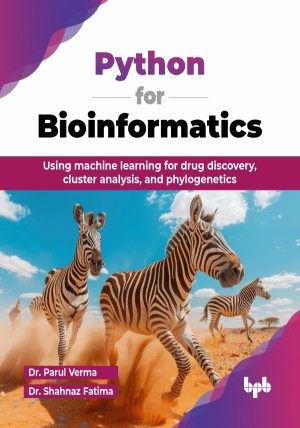

# Python for Bioinformatics

Using machine learning for drug discovery, cluster analysis, and phylogenetics.

This is the repository for [Python for Bioinformatics
](https://bpbonline.com/products/python-for-bioinformatics?variant=44277539340488),published by BPB Publications.

## About the Book
Python for Bioinformatics is an essential resource for anyone looking to integrate programming into their biological research. As the field of bioinformatics continues to expand, the ability to analyze vast amounts of biological data becomes increasingly crucial.

This book introduces bioinformatics, blending Python programming with biological data analysis. It covers essentials like string handling, regular expressions, file I/O, and object-oriented programming. You will explore Biopython for sequence alignment, format parsing, and accessing biological databases. Learn data visualization with Matplotlib and apply bioinformatics techniques like sequence alignment and phylogenetic analysis. The final chapter includes hands-on mini-projects to solidify your understanding, making it a practical guide for mastering bioinformatics and Python in real-world applications.

By bridging the gap between biology and computational science, this book empowers readers to tackle real-world challenges in their learning. With clear explanations and practical examples, readers will be well-prepared to apply Python for understanding biological data, contributing to advancements in the field of bioinformatics.

## What You Will Learn
• Understand core Python programming concepts for data analysis.

• Manipulate and analyze biological data effectively using Python.

• Create and manage functions and modules in Python code.

• Visualize complex datasets to identify patterns and insights.

• Implement file-handling techniques for various data types.

• Apply programming skills to real-world bioinformatics projects.
